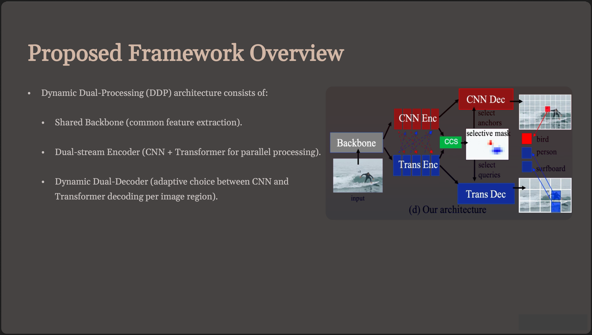
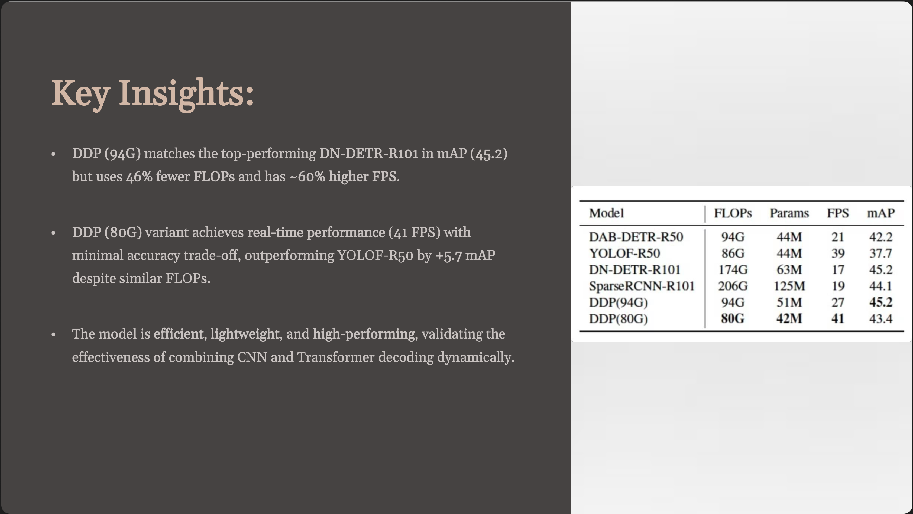

# CNN for Object Recognition

**A Visual Computing seminar exploring Convolutional Neural Networks for object recognition and the Dynamic Dual-Processing framework inspired by brain mechanisms.**

## Executive Summary

This presentation examines the evolution of computer vision from traditional CNNs to modern hybrid approaches. The focus centers on the Dynamic Dual-Processing (DDP) framework by Zhang et al. (2023), which combines CNN local feature extraction with Transformer global context understanding. This brain-inspired approach achieves state-of-the-art performance on MS COCO dataset while maintaining computational efficiency, demonstrating 46% fewer FLOPs than comparable models while achieving similar accuracy.

## Table of Contents

- [Slide Preview](#slide-preview)
- [Key Topics](#key-topics)
- [Learning Outcomes](#learning-outcomes)
- [Architecture Overview](#architecture-overview)
- [References](#references)
- [License](#license)

## Slide Preview

| Preview | Description |
|---------|--------------|
|  | Introduction to CNNs for Object Recognition |
|  | DDP Framework Architecture |
|  | Experimental Results and Performance |

📄 **[Download Full Presentation (PDF)](./slides/deck.pdf)**

## Key Topics

- **Convolutional Neural Networks**: Bio-inspired hierarchical feature extraction for visual data processing
- **Vision Transformers**: Self-attention mechanisms adapted for image understanding and global context
- **Dynamic Dual-Processing Framework**: Brain-inspired hybrid approach combining CNN and Transformer strengths
- **Object Detection Architectures**: Comparison of CNN-based (YOLO, Faster R-CNN) vs Transformer approaches
- **Neural Architecture Search**: Automated optimization for feature fusion between CNN and Transformer streams

## Learning Outcomes

**For Classmates**: Understand the complementary strengths of CNNs and Transformers in computer vision, learn about cutting-edge hybrid architectures, and explore biological inspiration in AI system design.

**For Recruiters**: Demonstrates knowledge of modern computer vision techniques, ability to analyze research papers, understanding of performance optimization in deep learning models, and presentation skills in technical communication.

## Architecture Overview

## References

1. Zhang, M., Bu, T., & Hu, L. (2023). *A Dynamic Dual-Processing Object Detection Framework Inspired by the Brain's Recognition Mechanism*. In Proceedings of the IEEE/CVF International Conference on Computer Vision (ICCV 2023).

2. Berrios, W., & Deza, A. (2022). *Joint Rotational Invariance and Adversarial Training of a Dual-Stream Transformer Yields State of the Art Brain-Score for Area V4*.

📄 **[Primary Paper PDF](./references/ddp-framework-2023.pdf)**  
📄 **[BibTeX Citations](./references/citations.bib)**

## Course Information

**Course**: COMP-8510 Visual Processing  
**Institution**: University of Windsor  
**Presenter**: Shaurya Parshad
**Date**: September 2025

## License

This project is licensed under the MIT License - see the [LICENSE](./LICENSE) file for details.

## Acknowledgments

- Course instructor and Visual Processing class participants
- Authors of the Dynamic Dual-Processing framework paper
- University of Windsor Computer Science Department
